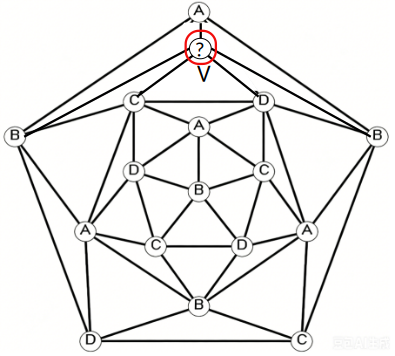
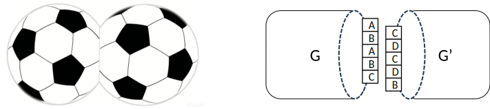
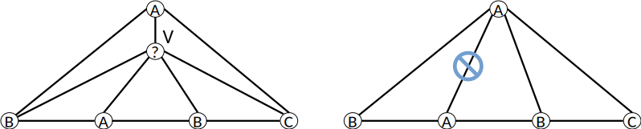

# 第四节　定理三：局部四色困难子图可在5-度顶点邻域间转移

定理三是证明路径中的关键一环，它说明"困难"是可以被搬运的。直观上：若某个5-度顶点邻域是个 GLFHO，我们可以把这个"麻烦"转移到另一个5-度顶点邻域，而原来的位置变得"不再麻烦"。

> **定理三**
>
> 设 G 是极小5-色平面图，某5-度顶点 u 的邻域在着色 φ 下构成 GLFHO R，
> 且 G 中存在另一个5-度顶点 v 与 u 不相邻。
> 则存在 G 的一个正常着色 φ'，使得在 φ' 下：
> G 中 u 的邻域不再是 GLFHO，且 G 的所有非 v 顶点仅使用颜色 {1,2,3,4}。
> 特别地，φ' 限制到 G - {v} 是一个正常4-着色。

## 4.1　证明思路：对称拼接与转移

以下是定理三的核心构造思路。

*图示：GLFHO 可以从一个5-度顶点邻域转移到另一个5-度顶点邻域。*

### 第一步：复制图

将 G 复制一份，得到 G' 与 G 结构完全相同。在 G' 中，对应的顶点记为 u' 和 v'。

*图示：假设 U 点为 GLFHO，手动增扩一个五边形面 V，作为 GLFHO 转移的目标位置。*

### 第二步：对称拼接

以5-度顶点 v（在 G 中）的边界为接口，将 G 和 G'（通过 v' 的边界）粘合在一起，得到一个新的对称平面图 H。

*图示：将 G 与其副本 G' 沿顶点 v/v' 的边界进行对称拼接，得到混合图 H。*

在 H 中：
- G-侧包含原来的 GLFHO R（在 u 邻域）
- G'-侧包含 R' = R 的副本（在 u' 邻域）

### 第三步：由定理二保证 GLFHO 消解

H 是简单平面图，且 G 为极小5-色图，故 G - {v} 可正常4-着色（性质5.1.3）。

对 H 赋予正常5-着色 φ_u：G-侧取 G 的5-着色（u 邻域为 GLFHO），G'-侧取 G - {v'} 的4-着色（仅用颜色 {1,2,3,4}）。

**关键论证**：G'-侧不含任何 GLFHO。

理由：GLFHO 要求中心顶点的颜色 e 不属于其邻居使用的颜色集 {a,b,c,d}，即 e 必须是第5种颜色。但 G'-侧所有顶点仅使用颜色 {1,2,3,4}，不存在第5种颜色，故 G'-侧无法形成 GLFHO。

由 H 的对称结构，设 σ 为交换 G-侧与 G'-侧的对称映射（固定 v 边界）。令 φ_u' = φ_u ∘ σ，则：

- G-侧获得原 G'-侧的着色结构（仅4种颜色，无 GLFHO）
- G'-侧获得原 G-侧的着色结构（含 GLFHO）

**结论**：在 φ_u' 下，G-侧无 GLFHO，u 的邻域不再构成 GLFHO。

### 第四步：结论

综合以上构造，着色 φ_u' 限制到 G-侧给出以下结果：

- u 的邻域在 φ_u' 下不再构成 GLFHO
- G-侧中除 v 以外的所有顶点仅使用颜色 {1,2,3,4}

即：φ_u' 限制到 G - {v} 是 G - {v} 的正常4-着色，且在此着色下 u 处无 GLFHO。

这正是定理三所要证明的结论。  □

## 4.2　定理三的作用：消解 GLFHO

定理三的核心价值在于：它提供了一种不依赖 Kempe 链交换的方法，将 G - {v} 从"含 GLFHO 的5-着色"转化为"无 GLFHO 的4-着色"。

在四色定理的主证明（第五节）中，定理三被如下使用：

1. **消解**：对极小5-色图 G 中的 GLFHO 中心 u 和另一个5-度顶点 v，通过对称拼接构造得到 G - {v} 的正常4-着色 φ'，且 φ' 下 u 处无 GLFHO。

2. **扩展**：从 G - {v} 的4-着色 φ' 扩展到 G 的4-着色。由于 v 是按需人工扩增的接口顶点，且扩展步骤处于纯4-着色环境（不存在构成 GLFHO Jordan 屏障所需的第5种颜色），Kempe 链交换必然可行，v 的着色扩展不构成困难（详见第五节 5.3 节）。

这个构造的关键特征在于：它**不依赖于追踪 Kempe 链的中间状态**，通过对称拼接的设计保证了 u 处 GLFHO 的消解。

## 4.3　定理三的前提条件

定理三依赖以下关键性质：

1. **极小性**（Minimality）：G 是极小5-色图 ⇒ G - {v} 可4-着色
   
   这保证了在构造 φ_u 时，G'-侧的着色可以仅使用4种颜色，从而 G'-侧不含 GLFHO。

2. **v 与 u 不相邻**：保证对称拼接后，u 的局部邻域结构不受 v 的粘合操作影响。

3. **唯一性**（定理二）：虽然定理三本身不直接使用定理二，但在主证明中，定理二保证了消解 u 处的 GLFHO 后，G - {v} 的4-着色中不会在其他位置产生新的 GLFHO（因为4-着色根本不具备形成 GLFHO 的颜色条件）。

## 4.4　与 Kempe 链交换的关系

定理三**不依赖于 Kempe 链交换**——这是与 Kempe 1879年方法的根本区别。

Kempe 的错误在于假设两条 Kempe 链可以安全地交换，而没有考虑它们可能相互缠绕的情况（即 GLFHO）。

定理三通过**对称拼接**来回避这个困难，用一个"整体的全局构造"替代了"局部的链交换操作"。
